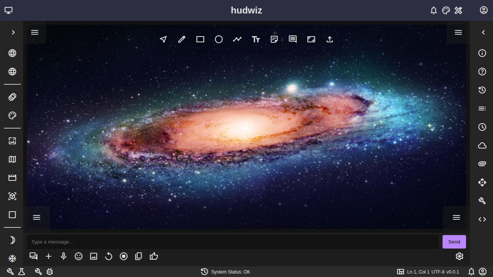
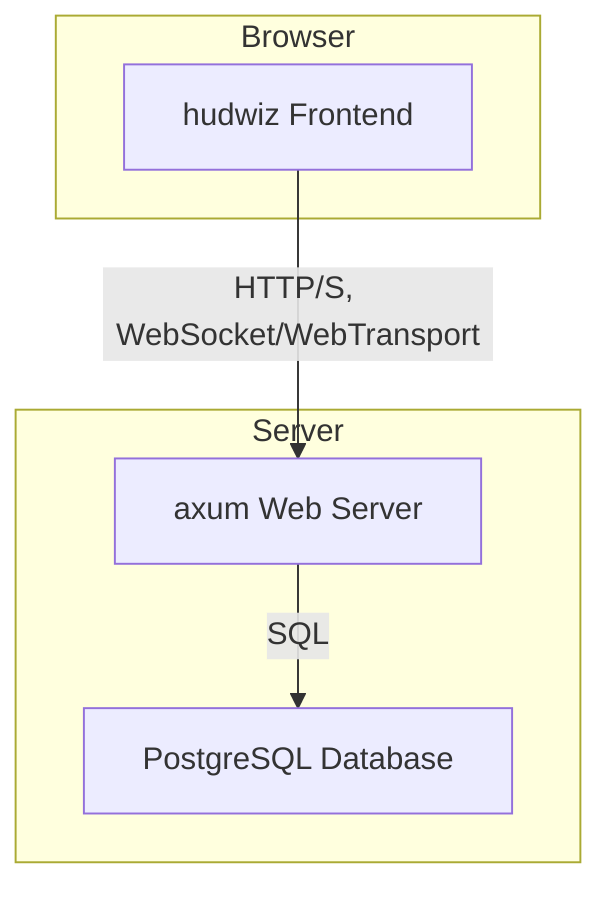

# hudwiz

**`hudwiz` is a highly configurable, multi-region web application framework built with Rust and Yew, designed for creating dynamic interfaces with multiple navigation and tool regions and corner Heads-Up Display (HUD) overlays.**

| Language | Build Status | License |
| :--- | :--- | :--- |
|  | [](https://github.com/constructableconcepts/hudwiz/actions) | [](LICENSE) |

[](https://www.reddit.com/r/rust/submit/?title=Check%20out%20this%20project%20on%20GitHub:%20https://github.com/constructableconcepts/hudwiz)

`hudwiz` provides a robust foundation for building complex, real-time web applications. Its modular architecture allows developers to easily compose UIs from a set of configurable regions, and its dynamic content rendering capabilities enable the creation of rich, interactive experiences.



## Table of Contents
- [Key Features](#-about)
- [Getting Started](#-whats-new)
- [Architecture](#-certification)
- [How to Build](#-how-to-build)
- [Documentation](#-documentation)
- [Feedback and Contributions](#-feedback-and-contributions)
- [License](#-license)
- [Contacts](#%EF%B8%8F-contacts)


## Key Features

*   **Multi-Region Layout:** A flexible, grid-based layout system with multiple, configurable regions.
*   **Dynamic Content:** Render any web content (iframes, videos, WebGL) in the main panel and background.
*   **Component-Based:** Built with the Yew framework, enabling a modern, component-based architecture.
*   **Themable:** A theme provider allows for easy customization of the application's appearance.
*   **Real-time Communication:** Integrated WebSocket and WebTransport support for real-time data exchange.
*   **Extensible:** A "block" system allows for the creation and sharing of pre-composed UI components.
*   **Authentication:** Built in authentication supporting a mock local provider, Auth Providers and SSO.

## Getting Started

This guide will walk you through the process of setting up and running the `hudwiz` application on your local machine.

### Tools

Before you begin, ensure you have the following tools installed:

*   **Rust:** The Rust programming language and its package manager, Cargo. You can install them by following the instructions at [rust-lang.org](https://www.rust-lang.org/tools/install).
*   **wasm-pack:** A tool for building Rust-generated WebAssembly that you can install with `cargo install wasm-pack`.

## 📝 How to Build

To build the packages, follow these steps:

```
# Open a terminal (Command Prompt or PowerShell for Windows, Terminal for macOS or Linux)

# Ensure Git is installed
# Visit https://git-scm.com to download and install console Git if not already installed

# Clone the repository
git clone https://github.com/Abblix/Oidc.Server.git

# Navigate to the project directory
cd Oidc.Server

# Check if .NET SDK is installed
dotnet --version  # Check the installed version of .NET SDK
# Visit the official Microsoft website to install or update it if necessary

# Restore dependencies
dotnet restore

# Compile the project
dotnet build

```

## Documentation

For more detailed information, please see the following documents:

*   **[User Guide](docs/user_guide.md):** A comprehensive guide to configuring and using the `hudwiz` client.
*   **[Integration Guide](docs/integration_guide.md):** A step-by-step tutorial for integrating `hudwiz` into your own applications.
*   **[Contributing Guide](CONTRIBUTING.md):** Guidelines for contributing to the `hudwiz` project.

## Architecture

`hudwiz` is built on a decoupled, client-server architecture. The frontend is a Single Page Application (SPA) created with the Yew framework, while the backend is a Rust server built with `axum`.

### Architectural Diagram

The following diagram provides a high-level overview of the `hudwiz` architecture:



## License

This project is licensed under the MIT License. See the [LICENSE](LICENSE) file for details.